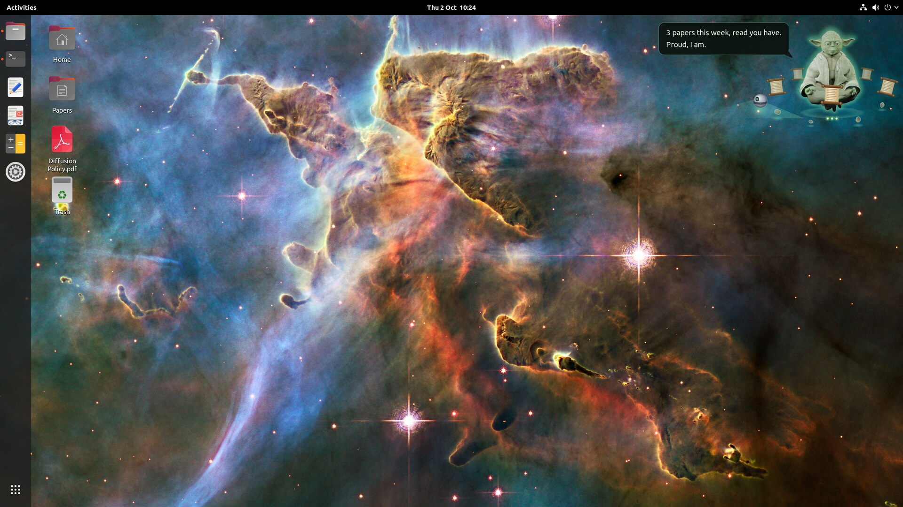
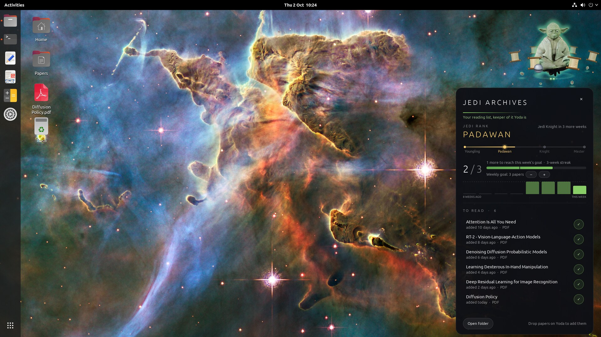
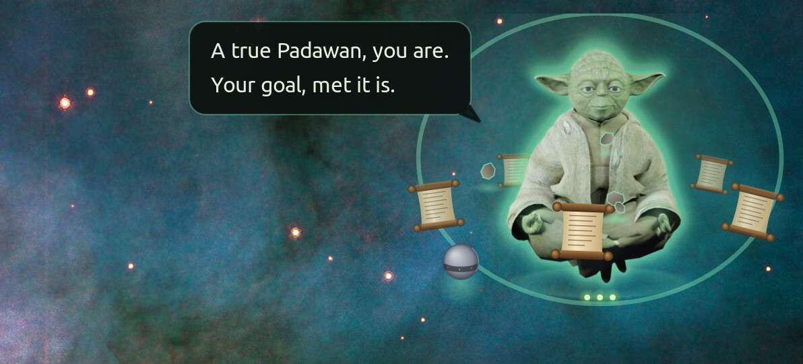
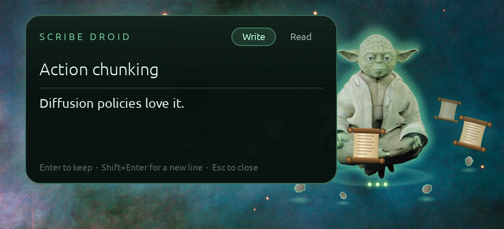

<div align="center">

# Yoda Desk

*Finish your weekly reading, you will.*

<a href="docs/demo.mp4"></a>

[▶ Watch the demo](docs/demo.mp4)

</div>

We all save papers we mean to read, and then forget them. Yoda Desk keeps them in front of you:
every paper you haven't read yet orbits Yoda, in the corner of your screen. Set a weekly goal,
tick papers off as you read, and he keeps count, nudges you when you fall behind, and celebrates
when you make it.

**I vibe-coded this mainly for myself, but it turned out to be pretty useful, so I'm sharing it.**

## How it works

1. Put the PDFs you mean to read in `~/Papers/To Read`, or drag them onto Yoda.
2. They orbit him as scrolls. Click one to open it.
3. Finished a paper? Click Yoda and tick it off.
4. Meet your weekly goal, and he celebrates.

## Your week at a glance

<p align="center"></p>

Click Yoda for your reading list: papers read this week against your goal, the last 8 weeks, and
every paper still waiting.

Keep it up and you rise through the Jedi ranks: meet your goal 2 weeks running to become a
**Padawan**, 4 more for **Jedi Knight**, and 6 more for **Jedi Master**. Miss a week and you drop a
rank, but every 12 weeks in a row earns a lifeline that forgives one.

## Yoda keeps you going

He talks to you about *your* week, in his own words: how many papers you've read, how long your
oldest has waited, how many days are left. Hover over him any time to ask.

<p align="center"></p>

Meet your goal and he celebrates. Rise a rank and your new rank glows beneath him.

## Notes

<p align="center"></p>

Click the little droid that circles him to jot down a thought. Each note is saved as a Markdown
file in `~/Papers/Notes`, ready for Obsidian or any editor.

## Install

Download this repository, then from its folder:

```bash
./yoda-desk install
```

He appears in the top-right corner of your screen, and at every login. You need Python 3 with
GTK 3, which most Linux desktops already have. On Ubuntu, if it's missing:

```bash
sudo apt install python3-gi python3-gi-cairo gir1.2-gtk-3.0
```

## Use

```bash
yoda-desk config        # papers folder, weekly goal, reminders, size
yoda-desk list          # open the reading list
yoda-desk note "idea"   # write a note (with no text, opens the note box)
yoda-desk notes         # read your notes
yoda-desk uninstall     # remove him; your papers and notes stay
```

You can also right-click Yoda for a menu, including **His size** if he comes out too small or too large for your screen.

<details>
<summary><b>Settings</b></summary>
<br>

Saved in `~/.config/yoda-desk/config.json`:

| Setting | Default | What it does |
|---|---|---|
| `papers_dir` | `~/Papers` | where `To Read` and `Read` live |
| `weekly_paper_goal` | `3` | papers a week (also changeable in the reading list) |
| `week_starts_on` | `monday` | the day your reading week starts |
| `remind_minutes` | `45` | how often he reminds you; `0` for never |
| `notes_dir` | `~/Papers/Notes` | where notes are kept |
| `size` | `1.0` | his size, from `0.5` to `2.5`, on top of what the screen suits (also under **His size** in his right-click menu) |
| `monitor` | `"primary"` | or a monitor number: `0`, `1`, … |

</details>

<details>
<summary><b>Good to know</b></summary>
<br>

- **Transparency needs a compositor.** GNOME, KDE, Cinnamon, XFCE and most desktops have one. On a bare window manager, run one such as `picom`.
- **Wayland** works through XWayland, with one difference: a compositor's bottom layer is where
  GNOME's desktop-icons window ends up too, and that window is transparent but takes every click,
  so he'd be visible and deaf. On Wayland he stays out of that layer. He still falls behind other
  windows, since he never takes focus, but he starts out in front of them. X11 works best.
- **Privacy.** Nothing leaves your computer, except title lookups for PDFs named after an arXiv ID, such as `2303.04137.pdf`.
- **Under the hood.** Three Python files in `app/`, and Yoda as pre-rendered images in `assets/yoda/`.

</details>

## Credits

- **Code:** MIT, see [LICENSE](LICENSE).
- **Yoda images:** rendered from ["Yoda Rig"](https://sketchfab.com/3d-models/yoda-rig-161ecf7f6a6647ae88a8a9dbba6f0cc5) by [TheWorm](https://sketchfab.com/Claudiotheworm), licensed [CC BY-NC 4.0](https://creativecommons.org/licenses/by-nc/4.0/): free to share with credit, not for commercial use. See [assets/yoda/LICENSE.md](assets/yoda/LICENSE.md).
- **Screenshots and demo:** wallpaper *Mystic Mountain* by NASA, ESA and the Hubble 20th Anniversary Team (STScI), public domain, mirrored; icons from the [Yaru](https://github.com/ubuntu/yaru) theme, CC BY-SA 4.0; the paper opened in the demo is [*Attention Is All You Need*](https://arxiv.org/abs/1706.03762) (Vaswani et al., 2017). They show Yoda, so they're non-commercial too.

<sub>Yoda is a character owned by Lucasfilm Ltd. This is an unofficial fan project, not affiliated with or endorsed by Lucasfilm or Disney.</sub>
